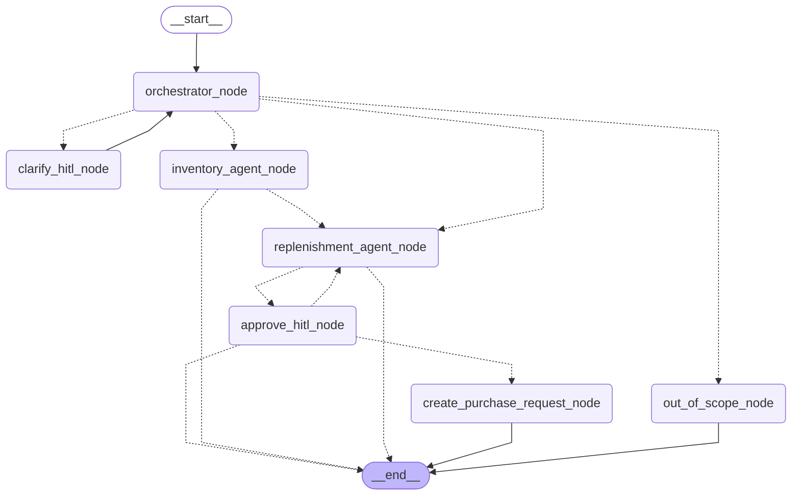

# Inventra — Agentic Warehouse Stockout Resolution

Inventra is a multi-agent system that helps an inventory manager prevent avoidable stockouts. For a single SKU in a single warehouse, it investigates whether stock is at risk, prepares a grounded replenishment proposal, pauses for human approval, and safely creates a purchase request - all from evidence already sitting in the existing systems, never from guesswork.~

## Features

- **Multi-agent system** - two specialist agents, each with a narrow, well-defined job.
- **Orchestrator pattern** - an LLM router interprets the request and decides which agent handles it, what needs clarifying, and what is out of scope.
- **Human-in-the-loop** - the graph pauses for a person whenever consent is required, and resumes from the same checkpoint.
- **Tool calling** - agents gather evidence through typed tools instead of recalling facts.
- **Tool access control** - a per-agent allowlist; each agent can call only the tools its role needs.
- **Contained input/output schemas** - inputs reject anything not declared, outputs are frozen so no downstream step can alter a result.
- **Centralized configuration** - every threshold and boundary lives in one frozen config object, never hardcoded in prompts or nodes.
- **Testing** — every capability covered branch by branch, including the failure paths, with fakes forcing the cases the seed data can't reach.

## Tech stack

- **Python**
- **LangChain**
- **LangGraph**
- **OpenAI**
- **Pydantic**
- **SQLite**
- **Pytest**

## Graph workflow

## Roadmap

- **Persistent checkpointer** - a SQLite/Postgres saver so paused cases survive a restart
- **FastAPI service** - expose the graph over HTTP, with resume as an endpoint
- **User interface** - render proposals and collect approvals
- **LLM usage monitoring** - token and cost tracking per case
- **Deployment**
